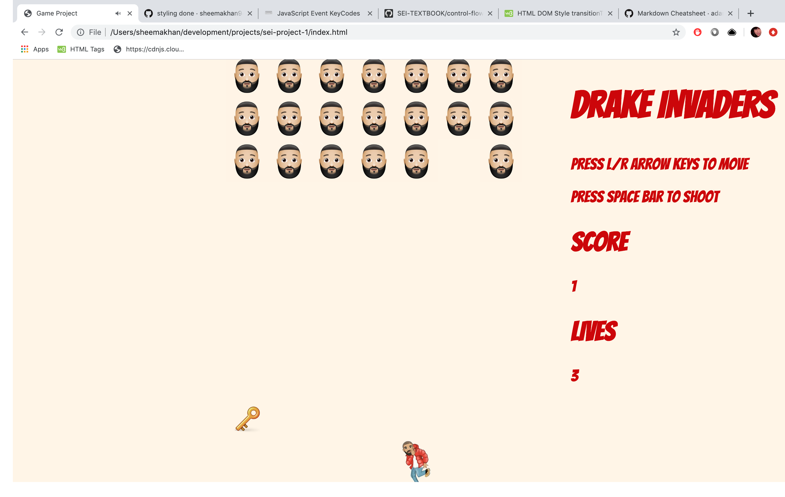

# SEI PROJECT 1 - SPACE INVADERS
## Building a front-end game
### Goal: Use the languages we have learned so far to build a simple single-page game.
#### Timeframe
7 days
### Technologies used
- HTML5
- CSS
- JavaScript
- GitHub

## My Game - Drake Invaders
#### Game Overview
My game is fundamentally a version of the popular Space Invaders using the characters of producer DJ Khaled as the 'space invader' and rapper Drake as the defender. The game plays on the fact that DJ Khaled is well known in the real world for posting videos to social in which he rants about his tips on being successful in life. Drake is tasked with calming down the DJ during one of these rants. The aim is to rid the gameboard of DJ Khaleds by throwing stacks of money at him while avoiding the enemy missiles - 'major keys'. The game is won when all of the Khaleds have been subdued; it is otherwise lost if Drake is hit by a key three times or Khaled encroaches on his space.
#### Controls
- Start game: click 'Start' button on splash screen
- Press left and right arrow keys to move player
- Press space bar to shoot money
- Press 'Play Again' button once the game is won or lost to play again



#### Making the game
The functionality of the game was built using entirely vanilla JavaScript. First I created a grid using CSS and JS with each square being an object in an array, then placed my defending character in the bottom row centre square. I used key codes to write a switch statement which moved the player icon either left or right by one square's width. If the player had to move, a function was then called which toggled classes on and off in order to render the player in the correct square. The same principle was applied when shooting the cash however the function was on a timed interval, with the cash sprite moving away vertically from the player's position by one square's width every .25 seconds:

```
function movePlayer() {
  squares.forEach(square => square.classList.remove('player'))
  squares[playerIndex].classList.add('player')
}

function shootCash() {
  squares[cashIndex].classList.add('cash')
  cashTimer = setInterval(moveCash, 250)
}

function handleKeyDown(e) {
  let playerShouldMove = true
  let cashShouldFire = false
  switch(e.keyCode) {
    case 39:
      if (playerIndex % width < width - 1) {
        playerIndex++
      }
      break
    case 37:
      if (playerIndex % width > 0) {
        playerIndex--
      }
      break
    case 32:
      cashShouldFire = true
      cashIndex = playerIndex - width
      break
    default:
      playerShouldMove = false
      cashShouldFire = false
  }
  if (playerShouldMove) movePlayer()
  if (cashShouldFire) shootCash()
}
```

The enemy icons were then placed on the grid and also set to a timer which moved them one square's width along until the last icon reached the end of the board, then down one and across the opposite way. The function checkForHits() would check whether a square with a class of 'cash' also had a class of 'enemy'. If so, it would remove the enemy class and add a point to the score counter. The same logic was then applied using 'key' and 'player' classes; if a square had both it would decrease the life count by 1.

#### Future Scope
If I had more time allotted I would have like to have added multiple levels with increasing difficulty by making the enemy move faster and drop more missiles.
